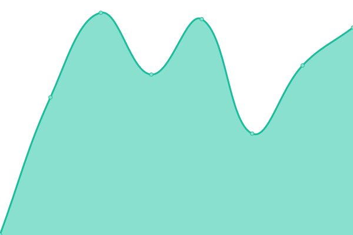

# [📈 Live Status](https://ysemashko.github.io/getcannab_uptime): <!--live status--> **🟥 Complete outage**

This repository contains the open-source uptime monitor and status page for [Yaroslav](https://ysemashko.github.io/getcannab_uptime), powered by [Upptime](https://github.com/upptime/upptime).

With [Upptime](https://upptime.js.org), you can get your own unlimited and free uptime monitor and status page, powered entirely by a GitHub repository. We use [Issues](https://github.com/ysemashko/getcannab_uptime/issues) as incident reports, [Actions](https://github.com/ysemashko/getcannab_uptime/actions) as uptime monitors, and [Pages](https://ysemashko.github.io/getcannab_uptime) for the status page.

<!--start: status pages-->
<!-- This summary is generated by Upptime (https://github.com/upptime/upptime) -->
<!-- Do not edit this manually, your changes will be overwritten -->
<!-- prettier-ignore -->
| URL | Status | History | Response Time | Uptime |
| --- | ------ | ------- | ------------- | ------ |
|  [GetCannab](https://getcannab.com) | 🟥 Down | [get-cannab.yml](https://github.com/ysemashko/getcannab_uptime/commits/HEAD/history/get-cannab.yml) | 

 204ms
     
 | 

<a href="https://ysemashko.github.io/getcannab_uptime/history/get-cannab">60.76%</a>
    

<!--end: status pages-->

[**Visit our status website →**](https://ysemashko.github.io/getcannab_uptime)

## 📄 License

- Powered by: [Upptime](https://github.com/upptime/upptime)
- Code: [MIT](./LICENSE) © [Yaroslav](https://ysemashko.github.io/getcannab_uptime)
- Data in the `./history` directory: [Open Database License](https://opendatacommons.org/licenses/odbl/1-0/)
